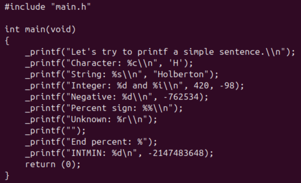
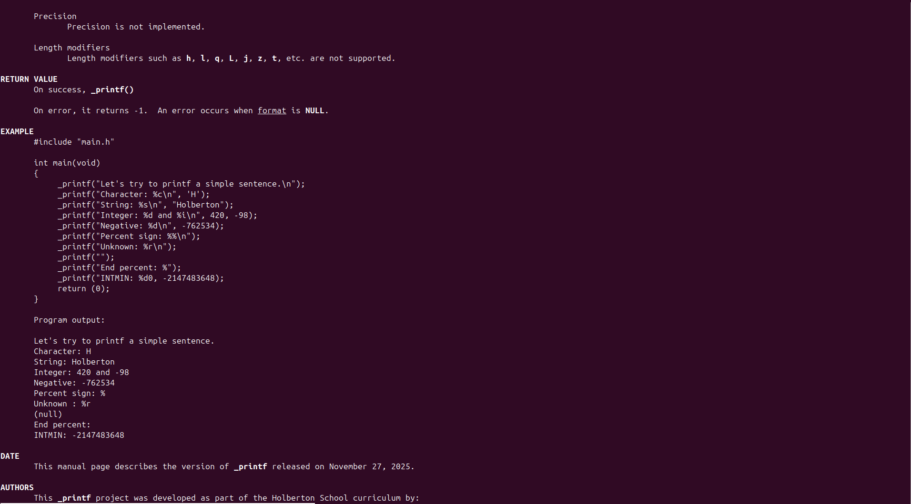

_PRINTF PROJECT

1. Project description

The _printf project is a custom implementation of the standard C library function printf.
This project reproduces the behavior of printf for several format specifiers and handles basic formatted output to the standard output stream.

Supported format specifiers
|Specifier|Description|
|-----|-----|
|%c|Prints a single character|
|%s|Prints a string of characters|
|%d, %i|Prints a signed decimal integer|
|%%|Prints a literal % character|

The goal of this project is to understand variadic functions, parsing of format strings, handling of conversion specifiers, and manual output formatting without using the real printf.

2. Compilation command

To compile the project, use:

gcc -Wall -Wextra -Werror -pedantic *.c -o  _printf

This creates an executable named _printf.

3. Requirements

The project must be built and tested in the following environment:

    * Ubuntu 20.04 LTS

    * GCC (GNU Compiler Collection)

    * Git for version control

    * Standard C libraries (stdlib.h, stdarg.h, unistd.h)

4. Usage Examples

The following examples illustrate the program’s usage.

Now the outputs:

5. Manual Page

To display the Man page, use the command:

man ./man_3_printf

or man 3 _printf

Summary of sections:

    * NAME — brief description

    * SYNOPSIS — basic usage

    * DESCRIPTION — main features

    * RETURN VALUE — descriptions of returned values

    * EXAMPLES — usage examples

    * COMPLEMENTARIES INFORMATIONS — date, authors etc

For more details, please refer to the full man page below.

6. Testing

A main.c file was used for testing. Compile and run:

gcc -Wall -Wextra -Werror -pedantic -std=gnu89 -Wno-format *.c

To ensure memory safety, use the command:

valgrind ./_printf.c

This will detects memory leaks, invalid memory accesses, and use of uninitialized memory.

7. Flowchart

The flowchart below illustrates the main steps and logic of the project.

8. Additional Notes

The project emphasizes modularity: each specifier is handled by a dedicated function.
Care must be taken with pointer handling.
Variadic functions (va_list, va_start, va_arg, va_end) are crucial to the implementation.

The authors of this project are Morgane Abbattista (Alreix) and Nicolas Da Silva (NicolasDS83600). The project was initialized on 11/24/2025 and completed on 11/27/2025.
