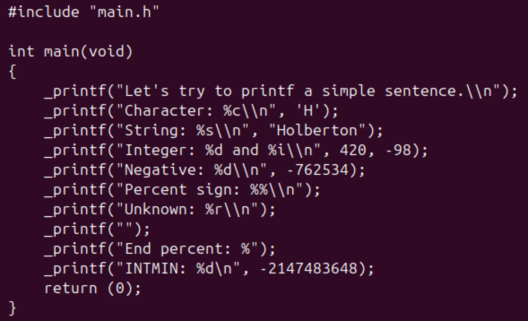
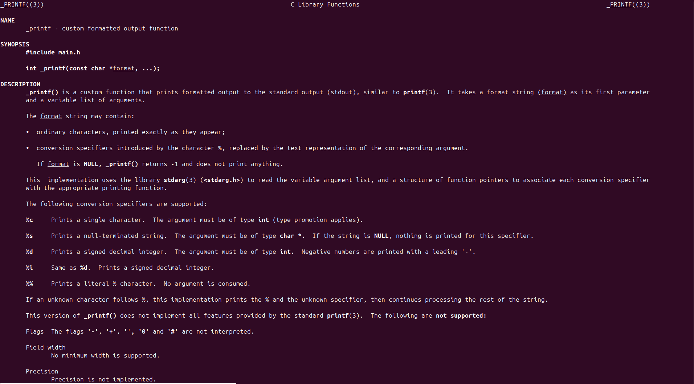
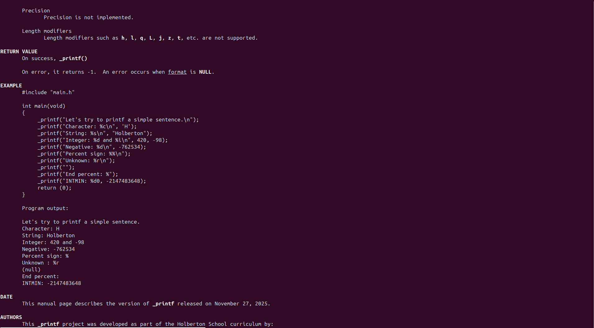
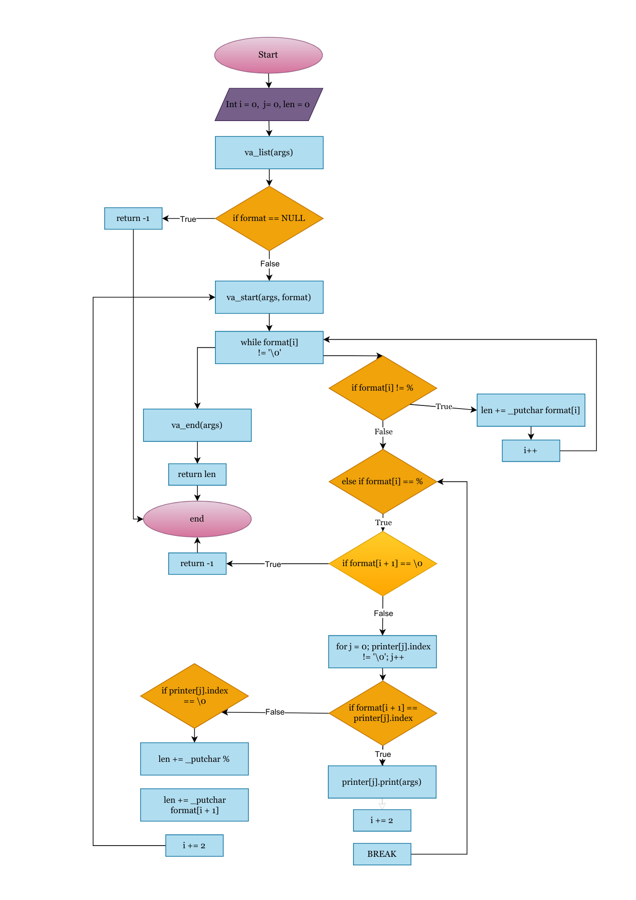

# _printf

> Custom implementation of the C `printf` function using variadic functions, format parsing and low-level output handling.

---

## Description

`_printf` is a custom implementation of the standard C library function `printf`.

This project reproduces basic formatted output behavior by parsing a format string and printing supported conversion specifiers to the standard output.

The project was developed as part of the Holberton School curriculum to practice variadic functions, modular programming, manual string parsing and low-level output handling in C.

---

## Objectives

* Recreate part of the behavior of the standard `printf` function.
* Understand variadic functions with `va_list`, `va_start`, `va_arg` and `va_end`.
* Parse format strings manually.
* Handle different conversion specifiers.
* Write output using low-level functions.
* Organize C code into modular functions.
* Practice memory-safe and readable C programming.

---

## Supported Format Specifiers

| Specifier | Description                        |
| --------- | ---------------------------------- |
| `%c`      | Prints a single character          |
| `%s`      | Prints a string of characters      |
| `%d`      | Prints a signed decimal integer    |
| `%i`      | Prints a signed decimal integer    |
| `%%`      | Prints a literal percent character |

---

## Technologies Used

* C
* GCC
* Linux / Ubuntu
* Variadic functions
* Git
* Betty style checker
* Valgrind

---

## Prerequisites

This project was developed and tested using:

* Ubuntu 20.04 LTS
* GCC
* Git
* Betty style checker
* Valgrind

Check GCC installation:

```bash
gcc --version
```

Check Valgrind installation:

```bash
valgrind --version
```

---

## Installation

Clone the repository:

```bash
git clone https://github.com/Alreix/holbertonschool-printf.git
cd holbertonschool-printf
```

Compile the project with a test file:

```bash
gcc -Wall -Wextra -Werror -pedantic -std=gnu89 *.c -o _printf
```

This creates an executable named:

```text
_printf
```

---

## Usage

Create or use a `main.c` file to test the `_printf` function.

Example:

```c
#include "main.h"

int main(void)
{
    _printf("Character: %c\n", 'H');
    _printf("String: %s\n", "Holberton");
    _printf("Integer: %d\n", 2026);
    _printf("Percent: %%\n");

    return (0);
}
```

Compile:

```bash
gcc -Wall -Wextra -Werror -pedantic -std=gnu89 *.c main.c -o _printf
```

Run:

```bash
./_printf
```

Example output:

```text
Character: H
String: Holberton
Integer: 2026
Percent: %
```

---

## Project Structure

```text
holbertonschool-printf/
├── main.h                  # Header file with prototypes and structures
├── _printf.c               # Main _printf function
├── print_char.c            # Character printing handler
├── print_string.c          # String printing handler
├── print_integer.c         # Integer printing handler
├── get_function.c          # Specifier selection logic
├── man_3_printf            # Manual page
├── Images/                 # Images used in the README
└── README.md               # Project documentation
```

File names may vary depending on the final project organization.

---

## Features

* Custom `_printf` function.
* Format string parsing.
* Support for `%c`, `%s`, `%d`, `%i` and `%%`.
* Modular handler functions.
* Manual output handling.
* Return value based on number of printed characters.
* Manual page included.

---

## Screenshots

Example test file:



Example output:


Flowchart:


Manual page preview:





---

## Manual Page

A manual page is included in the repository.

To display it, use:

```bash
man ./man_3_printf

or man 3 _printf

Summary of sections:

    * NAME — brief description

    * SYNOPSIS — basic usage

    * DESCRIPTION — main features

    * RETURN VALUE — descriptions of returned values

    * EXAMPLES — usage examples

    * COMPLEMENTARIES INFORMATIONS — date, authors etc

For more details, please refer to the full man page below.


6. Testing

A main.c file was used for testing. Compile and run:

gcc -Wall -Wextra -Werror -pedantic -std=gnu89 -Wno-format *.c

To ensure memory safety, use the command:

valgrind ./_printf.c

This will detects memory leaks, invalid memory accesses, and use of uninitialized memory.

7. Flowchart

The flowchart below illustrates the main steps and logic of the project.



8. Additional Notes

The project emphasizes modularity: each specifier is handled by a dedicated function.
Care must be taken with pointer handling.
Variadic functions (va_list, va_start, va_arg, va_end) are crucial to the implementation.

The authors of this project are Morgane Abbattista (Alreix) and Nicolas Da Silva (NicolasDS83600). The project was initialized on 11/24/2025 and completed on 11/27/2025.
